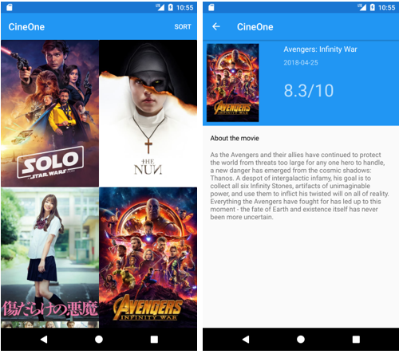
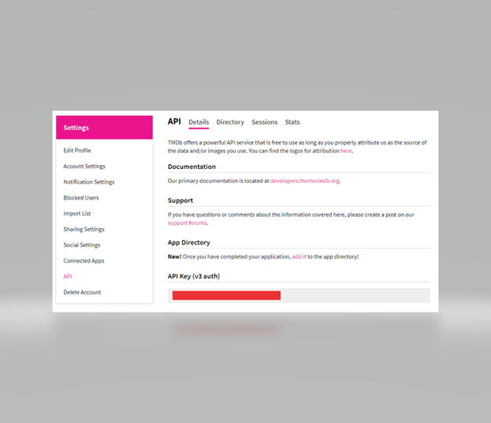

# Popular Movies
This is an  Android application developed  in Java, which consumes TheMovieDB RESTful API. We will provide users with he possibility of filtering movies by popularity, as-well as based on user ratings.
 
# Libraries

To save time and achieve the best possible performances, we will make use of several third-party libraries.

We will use the following libraries:

    Picasso : A powerful image downloading and caching library for Android

    Retrofit : A type-safe HTTP client for Android and Java

    ButterKnife : Field and method binding for Android views

    Support Design Libraries : Introduces Material Design components and patterns

To make use of these libraries, add the following dependencies to your App-Level Gradle file.
/Picasso
implementation 'com.squareup.picasso:picasso:2.5.2'

//Retrofit Dependencies
implementation 'com.squareup.retrofit2:retrofit:2.1.0'
implementation 'com.squareup.retrofit2:converter-gson:2.1.0'

//Design libraries
implementation "com.android.support:design:27.1.1"
implementation "com.android.support:recyclerview-v7:27.1.1"
implementation "com.android.support:cardview-v7:27.1.1"

//ButterKnife
implementation 'com.jakewharton:butterknife:8.8.1'
annotationProcessor 'com.jakewharton:butterknife-compiler:8.8.1'
# API

To access TheMovieDB API, you must create an account to retrieve an API key, which will be used to authenticate every request. The key is free is for personal use.

Once you have created an account, you must navigate to Settings -> API, where you will find an API Key (v3 auth)

